# Code Process

This document is a human-readable walkthrough of how the Demarcator codebase works today.

It focuses on:

- what the project is trying to accomplish
- how requests move through the system
- how persistence works
- what each code file is responsible for
- what each function or method does

The goal is that someone new to the repo can read this once and understand the current implementation shape without reverse-engineering every file from scratch.

## 1. Project intent

Demarcator is the control layer around AI workflows.

It is not trying to be:

- the user-facing chatbot
- the model layer
- the workflow runtime itself

It is trying to be:

- the system that decides who can run a workflow
- the system that decides what data a workflow can use
- the system that decides whether an action is blocked, drafted, or queued for approval
- the system that records runs, approvals, alerts, and audit history

`pi` or another runtime can trigger work, but Demarcator owns policy and visibility.

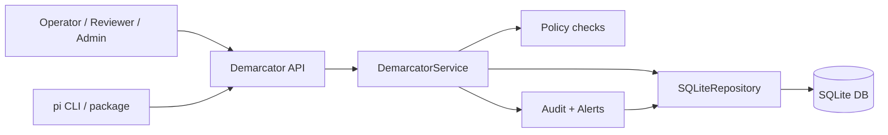

## 2. Current architecture

The codebase is intentionally small and layered.

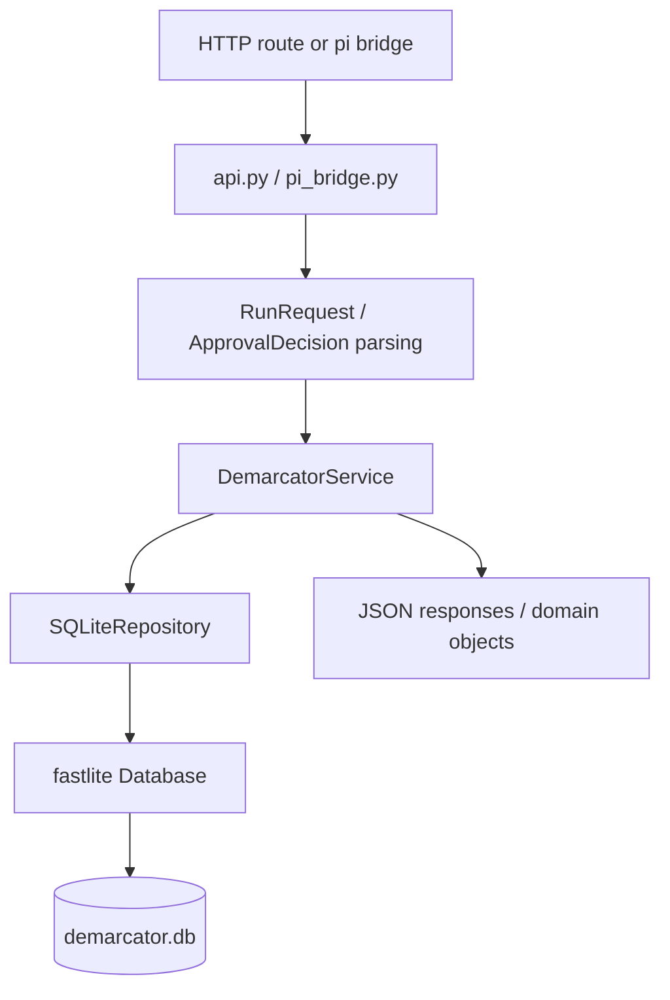

## 3. Main runtime flows

### 3.1 Workflow run flow

This is the core path when someone triggers a workflow.

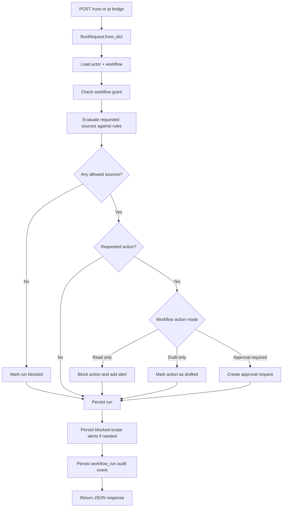

### 3.2 Approval decision flow

This path handles reviewer approval or rejection.

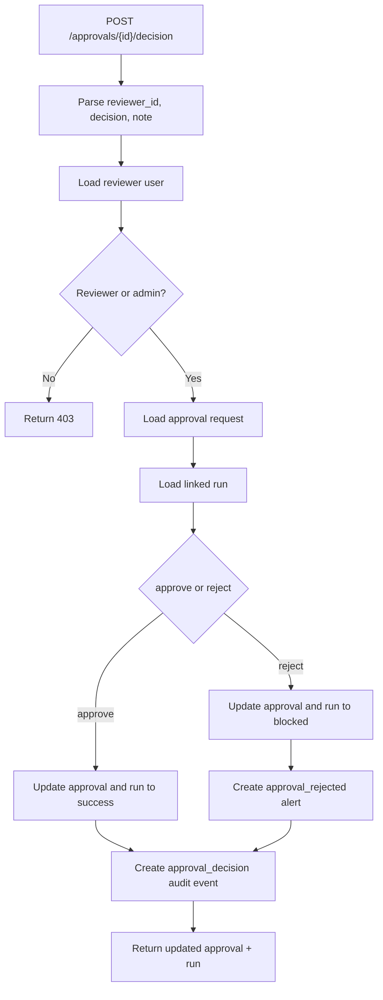

### 3.3 Persistence flow

The current code uses SQLite through `fastlite`.

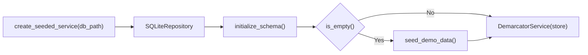

## 4. Database shape

The repository stores both business entities and execution history.

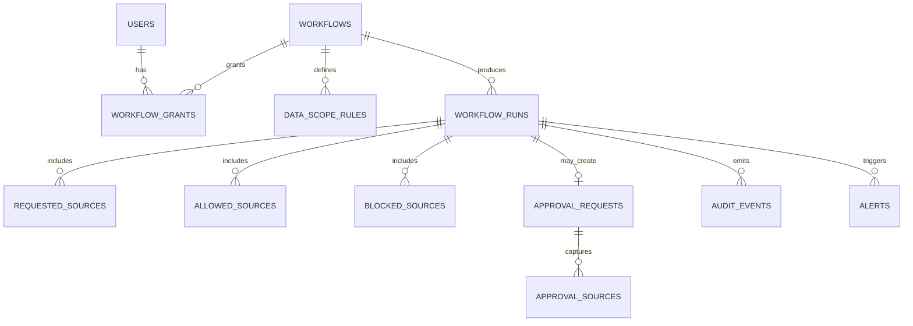

This schema is intentionally simple:

- seed data tables hold users, connectors, workflows, rules, and grants
- execution tables hold runs, approvals, audit events, and alerts
- source lists are normalized into side tables rather than stored as a single blob
- audit event details stay JSON because they are intentionally flexible

## 5. File-by-file walkthrough

## `src/demarcator/models.py`

Purpose:

- defines the domain language used across the rest of the project
- converts raw payloads into strongly-shaped Python objects
- centralizes IDs, timestamps, enums, and serialization helpers

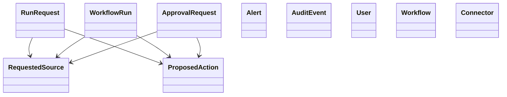

Functions and classes:

- `utc_now()`
  Returns the current UTC timestamp as a `datetime`.
- `new_id(prefix)`
  Generates short IDs such as `run_xxx`, `approval_xxx`, `evt_xxx`, and `alert_xxx`.
- `Role`
  Declares the four current user roles: admin, operator, reviewer, viewer.
- `ActionMode`
  Declares workflow safety behavior: `read_only`, `draft_only`, `approval_required`.
- `RunStatus`
  Declares current run result states.
- `ConnectorHealth`
  Describes health for a connected app.
- `ApprovalDecision`
  Represents the incoming reviewer decision.
- `ApprovalStatus`
  Represents the stored state of an approval request.
- `User`
  Small record for an actor in the system, with `to_dict()` for API responses.
- `Connector`
  Stores connected-app display information and health.
- `Workflow`
  Stores workflow metadata and its action mode.
- `RequestedSource`
  Represents one data scope request like `email:mailbox/operations`.
- `ProposedAction`
  Represents a possible side effect such as `send_email`.
- `DataScopeRule`
  Stores allowed scopes for a workflow and connector pair.
- `DataScopeRule.allows(scope)`
  Returns `True` when the scope exactly matches or falls under an allowed prefix.
- `WorkflowGrant`
  Links a user to a workflow they can run.
- `ApprovalRequest`
  Stores a pending or decided action review request.
- `AuditEvent`
  Stores a structured historical event.
- `WorkflowRun`
  Stores the outcome of a workflow execution attempt.
- `Alert`
  Stores operational alerts such as blocked access or rejected approval.
- `RunRequest`
  Input object for workflow execution.
- `RunRequest.from_dict(payload)`
  Transforms JSON request payloads into `RunRequest` objects.

## `src/demarcator/store.py`

Purpose:

- owns SQLite access
- creates schema
- seeds demo data
- turns rows into domain objects and domain objects back into rows

This file is the persistence boundary of the application.

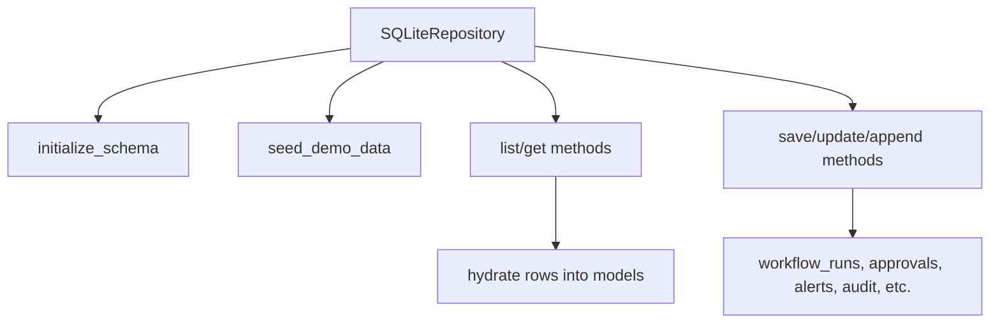

Functions and methods:

- `SQLiteRepository.__init__(db_path)`
  Opens the SQLite database through `fastlite.Database`.
- `transaction()`
  Context manager that wraps a begin/commit/rollback cycle.
- `initialize_schema()`
  Creates all required tables and indexes if they do not already exist.
- `is_empty()`
  Uses the `users` table count to decide whether demo seed data should be inserted.
- `seed_demo_data()`
  Inserts the initial users, connectors, workflows, rules, and grants.
- `list_connectors()`
  Loads all connectors ordered by ID.
- `list_workflows()`
  Loads all workflows ordered by ID.
- `get_workflow(workflow_id)`
  Loads a single workflow or returns `None`.
- `list_rules()`
  Loads `data_scope_rules` and groups multiple rows into `DataScopeRule` objects.
- `list_rules_for_workflow(workflow_id)`
  Filters all rules down to one workflow.
- `list_users()`
  Loads all users.
- `get_user(user_id)`
  Loads a single user or returns `None`.
- `list_workflow_grants()`
  Loads all user-to-workflow grants.
- `has_workflow_grant(user_id, workflow_id)`
  Checks whether a user may run a workflow.
- `save_run(run)`
  Inserts a new workflow run plus requested, allowed, and blocked source rows.
- `update_run(run)`
  Updates a stored run and replaces its source rows.
- `get_run(run_id)`
  Loads one workflow run and hydrates nested source lists.
- `list_runs()`
  Loads all runs ordered newest first.
- `save_approval(approval)`
  Inserts a new approval request and its source rows.
- `update_approval(approval)`
  Updates a stored approval request.
- `get_approval(approval_id)`
  Loads one approval request.
- `list_approvals()`
  Loads all approvals ordered newest first.
- `append_audit_event(event_type, actor_id, run_id, workflow_id, details)`
  Creates and stores a new `AuditEvent`.
- `list_audit_events()`
  Loads all audit events ordered newest first.
- `append_alert(alert_type, severity, summary, run_id, workflow_id)`
  Creates and stores a new `Alert`.
- `list_alerts()`
  Loads all alerts ordered newest first.
- `_replace_sources(table, run_id, sources)`
  Rebuilds one of the run-source side tables.
- `_replace_approval_sources(approval_id, sources)`
  Rebuilds the `approval_sources` side table.
- `_load_sources(table, run_id)`
  Loads source rows for a run from a specific side table.
- `_load_approval_sources(approval_id)`
  Loads source rows attached to an approval.
- `_hydrate_run(row)`
  Converts a raw `workflow_runs` row plus side tables into a `WorkflowRun`.
- `_hydrate_approval(row)`
  Converts a raw approval row plus side table into an `ApprovalRequest`.

## `src/demarcator/services.py`

Purpose:

- contains business rules
- coordinates repository reads and writes
- decides when a run is allowed, blocked, drafted, or sent for approval

This file is the application brain.

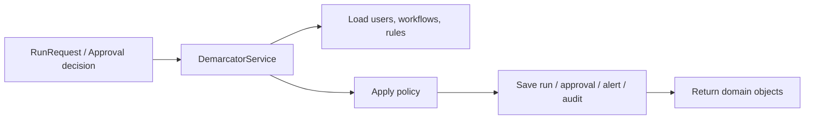

Functions, classes, and methods:

- `DemarcatorError`
  Base application error for API-safe failures.
- `NotFoundError`
  Raised when a referenced user, workflow, run, or approval does not exist.
- `PermissionDeniedError`
  Raised when the actor is not allowed to do the requested operation.
- `ApprovalDecisionResult`
  Wrapper object returned after an approval decision so the API can return both approval and run.
- `ApprovalDecisionResult.to_dict()`
  Serializes both child objects for JSON output.
- `DemarcatorService.__init__(store)`
  Receives the repository dependency.
- `list_connectors()`
  Returns connector rows ready for the API.
- `list_workflows()`
  Returns workflow rows ready for the API.
- `list_rules()`
  Returns grouped data-scope rules ready for the API.
- `list_people()`
  Joins users and workflow grants into a simple API-friendly structure.
- `list_activity()`
  Returns runs as API dictionaries.
- `list_approvals()`
  Returns approvals as API dictionaries.
- `list_audit_events()`
  Returns audit events as API dictionaries.
- `list_alerts()`
  Returns alerts as API dictionaries.
- `summary()`
  Computes the summary dashboard counts from persisted data.
- `run_workflow(request)`
  Main workflow execution coordinator.
  It loads actor and workflow, checks permission, evaluates data scope, applies action-mode rules, persists the run, writes alerts when needed, and records a workflow audit event.
- `decide_approval(approval_id, reviewer_id, decision, note)`
  Main approval review coordinator.
  It validates reviewer permissions, loads the approval and run, updates both objects, persists rejection alerts if needed, and records an approval audit event.
- `_count_stale_approvals()`
  Counts approvals older than four hours that are still pending.
- `_record_alert(...)`
  Thin wrapper that delegates alert writes to the repository.
- `_record_audit_event(...)`
  Thin wrapper that delegates audit writes to the repository.
- `_evaluate_sources(workflow_id, requested_sources)`
  Compares requested scopes against allowed workflow rules and splits them into allowed and blocked lists.
- `_handle_action_request(...)`
  Applies action-mode behavior:
  blocks actions for read-only workflows, marks drafts for draft-only workflows, or creates an approval request for approval-required workflows.
- `_require_user(user_id)`
  Loads a user or raises `NotFoundError`.
- `_require_workflow(workflow_id)`
  Loads a workflow or raises `NotFoundError`.
- `_ensure_actor_can_run(actor, workflow)`
  Allows admins automatically and otherwise requires a workflow grant.

## `src/demarcator/api.py`

Purpose:

- converts HTTP-like input into service calls
- converts service results and exceptions into HTTP-style responses
- provides the actual server entrypoint

The important design choice here is that the file exposes both a real `http.server` implementation and a test-friendly `DemarcatorAPI.handle()` method.

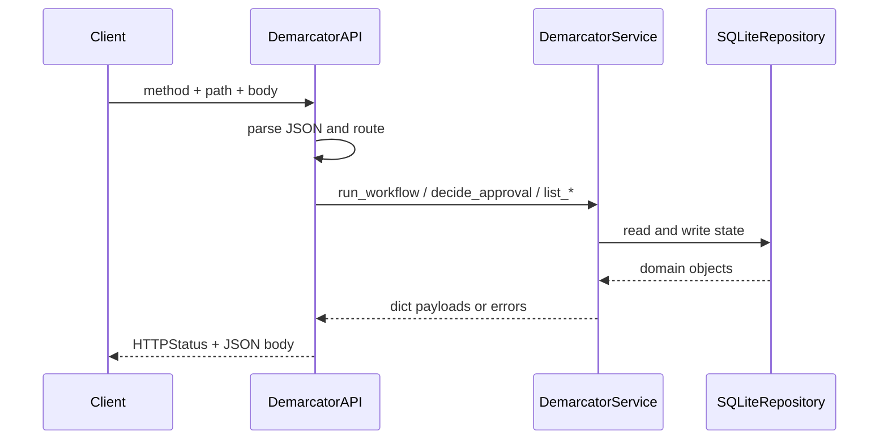

Functions, classes, and methods:

- `DemarcatorAPI.__init__(service)`
  Receives the service dependency.
- `DemarcatorAPI.handle(method, path, body)`
  Main in-process request dispatcher used heavily by the tests.
- `DemarcatorAPI._handle_get(path)`
  Maps GET paths to list and summary service methods.
- `DemarcatorAPI._handle_post(path, body)`
  Parses JSON, routes POST requests, and converts common service errors into status codes.
- `DemarcatorAPI._read_json_body(body)`
  Parses JSON bytes and returns either the payload or a `400` error tuple.
- `DemarcatorRequestHandler`
  Thin `BaseHTTPRequestHandler` adapter that delegates to `DemarcatorAPI`.
- `DemarcatorRequestHandler.do_GET()`
  Sends GET responses through the in-process app.
- `DemarcatorRequestHandler.do_POST()`
  Reads request bytes, then delegates to the in-process app.
- `DemarcatorRequestHandler.log_message(...)`
  Disables default noisy request logging.
- `DemarcatorRequestHandler._write_json(status, payload)`
  Writes JSON bytes to the HTTP response stream.
- `build_api(db_path)`
  Creates a fully wired `DemarcatorAPI` instance with a seeded SQLite-backed service.
- `build_server(host, port, db_path)`
  Creates the `ThreadingHTTPServer` with an app bound into a custom handler class.
- `main()`
  CLI entrypoint that parses host, port, and database path and starts the server.

## `src/demarcator/bootstrap.py`

Purpose:

- centralizes startup wiring
- ensures schema creation and one-time seed behavior happen in one place

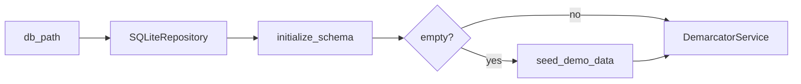

Functions and constants:

- `DEFAULT_DB_PATH`
  Default database filename used by the API when no explicit path is supplied.
- `create_seeded_service(db_path=DEFAULT_DB_PATH)`
  Builds the repository, initializes schema, seeds demo data on an empty database, and returns a ready-to-use service.

## `src/demarcator/pi_bridge.py`

Purpose:

- gives `pi` or any CLI caller a simple way to create workflow runs against the Demarcator API

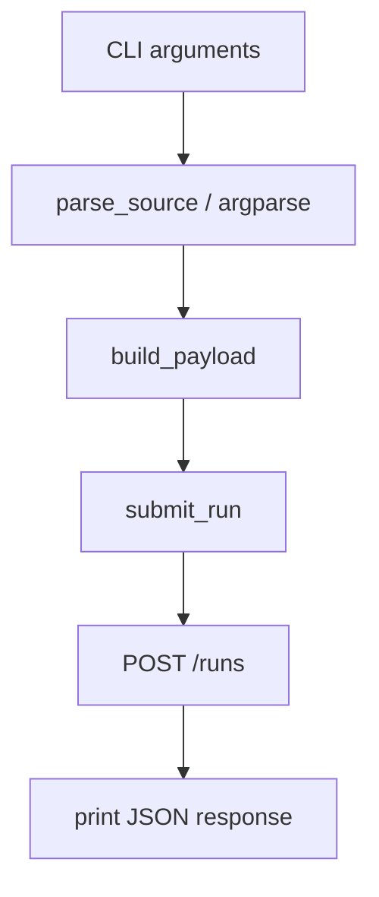

Functions:

- `parse_source(value)`
  Parses one `connector_id:scope` CLI argument into a dictionary for the API payload.
- `build_payload(args)`
  Converts parsed CLI arguments into the JSON body expected by `/runs`.
- `submit_run(server, payload)`
  Sends an HTTP request to Demarcator and returns the parsed JSON response.
- `main()`
  CLI entrypoint that wires argument parsing, payload building, submission, and output printing.

## `src/demarcator/__init__.py`

Purpose:

- exposes `create_seeded_service` as a simple package-level import

Contents:

- module docstring
- import of `create_seeded_service`
- `__all__` declaration to keep the export explicit

There is no additional runtime logic in this file.

## `demarcator/__init__.py`

Purpose:

- acts as a top-level shim so `python -m demarcator.api` works cleanly with the `src/` layout

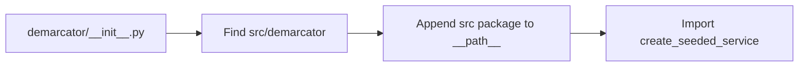

Contents:

- computes the repo root and `src/demarcator` path
- appends that path to `__path__` if present
- re-exports `create_seeded_service`

This file exists for packaging and module-resolution convenience.

## `sitecustomize.py`

Purpose:

- inserts `src/` into `sys.path` automatically for local execution

Contents:

- computes repo root and `src/`
- appends `src/` to `sys.path` if it exists and is not already present

This reduces friction when running local Python commands from the repo root.

## `tests/__init__.py`

Purpose:

- ensures the test runner can import the `src/` package layout

Contents:

- computes repo root and `src/`
- prepends `src/` to `sys.path` if needed

## `tests/test_services.py`

Purpose:

- tests service-level business logic against a real temporary SQLite database

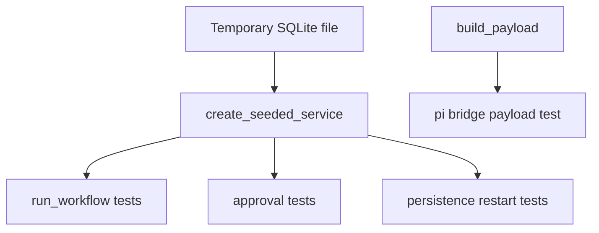

Test methods:

- `setUp()`
  Creates a temp directory and temp database, then builds a seeded service.
- `tearDown()`
  Cleans up the temp directory.
- `test_run_requires_workflow_grant()`
  Verifies unauthorized users cannot run workflows.
- `test_blocked_sources_are_recorded_but_allowed_sources_continue()`
  Verifies mixed allowed and blocked scopes still run and create alert state.
- `test_approval_required_action_creates_pending_approval()`
  Verifies an action request creates a pending approval linked to the run.
- `test_approval_decision_updates_run()`
  Verifies approval updates both approval and run state.
- `test_read_only_workflow_blocks_requested_action()`
  Verifies read-only workflows reject side effects and create the right alert.
- `test_seed_data_persists_across_service_restart()`
  Verifies seed data is not duplicated or lost when rebuilding the service on the same DB.
- `test_run_persists_across_service_restart()`
  Verifies runs survive restart because they are stored in SQLite.
- `test_pi_bridge_payload_shape()`
  Verifies the CLI payload builder produces the expected JSON shape.

## `tests/test_api.py`

Purpose:

- tests API routing, error handling, and persistence using `DemarcatorAPI.handle()`

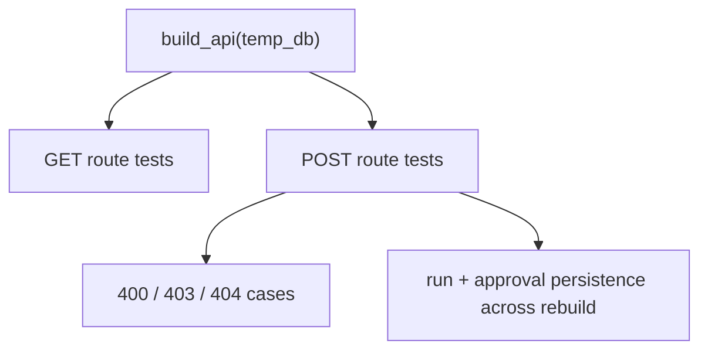

Test methods:

- `setUp()`
  Creates a temp database and builds an in-process API.
- `tearDown()`
  Cleans up the temp database directory.
- `test_health_endpoint()`
  Verifies `/health`.
- `test_unknown_route_returns_404()`
  Verifies unmatched routes return `404`.
- `test_invalid_json_returns_400()`
  Verifies malformed JSON returns `400`.
- `test_missing_required_field_returns_400()`
  Verifies missing required run fields return `400`.
- `test_non_reviewer_cannot_decide_approval()`
  Verifies non-reviewers receive `403` for approval decisions.
- `test_unknown_approval_returns_404()`
  Verifies missing approvals return `404`.
- `test_run_and_approval_survive_rebuild()`
  Verifies persisted state is still present after rebuilding the API with the same DB path.

## 6. How the files fit together

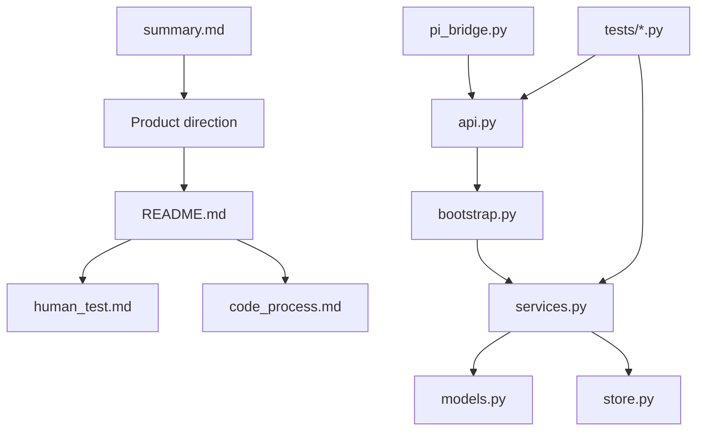

## 7. Mental model for reading the repo

If you only have a few minutes, read in this order:

1. `summary.md`
   This explains the business intent.
2. `README.md`
   This explains how to run the current implementation.
3. `src/demarcator/api.py`
   This shows the external API surface.
4. `src/demarcator/services.py`
   This shows the actual business rules.
5. `src/demarcator/store.py`
   This shows how the rules are persisted.
6. `src/demarcator/models.py`
   This defines the shared vocabulary used by everything else.

## 8. Current limitations

The code is intentionally small and still prototype-grade.

Important limitations:

- authentication is not implemented yet
- the system trusts incoming `actor_id` and `reviewer_id`
- approval release does not yet execute a real downstream action
- connectors are policy metadata, not full adapter implementations
- the API is built on the standard library server for simplicity, not production deployment features

Those limitations are acceptable for the current control-plane prototype, but they define the next implementation steps.
